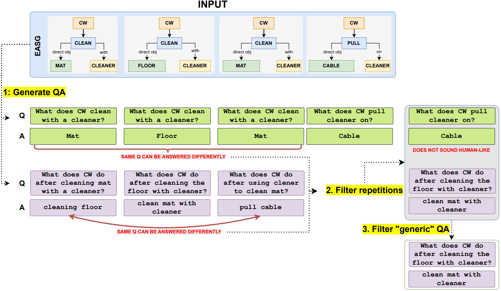

# EASG-Bench: Video Q&A Benchmark with Egocentric Action Scene Graphs
Ivan Rodin<sup>*1</sup>, Tz-Ying Wu<sup>*2</sup>, Kyle Min<sup>2</sup>, Sharath Nittur Sridhar<sup>2</sup>, Antonino Furnari<sup>1</sup>, Subarna Tripathi<sup>2</sup>, and Giovanni Maria Farinella<sup>1</sup>  

<sup>1</sup>University of Catania    <sup>2</sup>Intel Labs

We introduce **EASG-Bench**, a question-answering benchmark for egocentric videos where the question-answering pairs are created from spatio-temporally grounded dynamic scene graphs capturing intricate relationships among actors, actions, and objects. We propose a systematic evaluation framework and evaluate several language-only and video large language models (video-LLMs) on this benchmark. We observe a performance gap in language-only and video-LLMs, especially on questions focusing on temporal ordering, thus identifying a research gap in the area of long-context video understanding.

## Benchmark Creation
We provide the script for creating the benchmark in `generate_QA.ipynb`. The data generation pipeline is summarized in the following image. Please refer to the paper for more details.

<p align="center">
  
</p>


## Evaluation
The evaluation adopts a LLM-as-a-Judge mechanism as described in the paper.

The evaluation code is provided in the `eval` folder, with the main script `eval_llama_review.py` taking the following arguments:
- **[Context]** Context information about the video content. We extracted timestamped narrations from Ego4D annotations, and provide the preprocessed data in `clilp_narrations.json`.
- **[Rule]** Rule for the LLM to follow for judging the QA quality, provided in `rule.txt`.
- **[Answers]** An input json file containing the QA pairs to evaluate, in the format of
```
{
    'vid': '49d65bed-9479-427e-bb68-0c9a18560ac6',
    'type': 'purpose',
    'question': 'What is the purpose of the cardboard in the video?',
    'answer': 'The cardboard is being cut, arranged, cleaned off, and put away, indicating it is being used as a material for a project or task.',
    'prediction': 'The cardboard in the video appears to be used for crafting and creating various objects. The person is seen cutting, folding, and assembling pieces of cardboard into different shapes and structures. This suggests that the cardboard is being utilized as a material for DIY projects or artistic creations.'
}
```
Note that the quality scores assigned by the LLM judge and the corresponding explanations will be appended to this file when the evaluation is done.
- **[Outputs]** A json file containing the evaluation outputs, i.e., the scores per category.
- **[Scale]** As discussed in the paper, we rescaled the quality scores assigned to the candidate answers by the LLM according to the scores assigned to ground truth answers. The scaling factor per category is provided in `scale.json`.

The arguments introduced above can be configured in `eval_llama.sh`, and you can get the evaluation score by running this script, i.e.,
```
$ bash eval_llama.sh
```

## Cite
```

@article{rodin2025easg,
  title={EASG-Bench: Video Q\&A Benchmark with Egocentric Action Scene Graphs},
  author={Rodin, Ivan and Wu, Tz-Ying and Min, Kyle and Sridhar, Sharath Nittur and Furnari, Antonino and Tripathi, Subarna and Farinella, Giovanni Maria},
  journal={arXiv preprint},
  year={2025},
}
```
